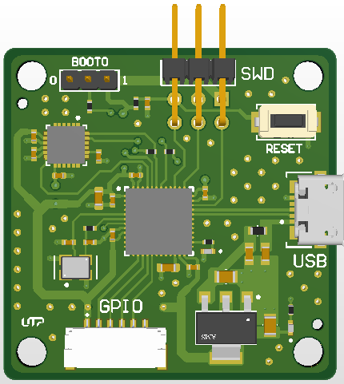
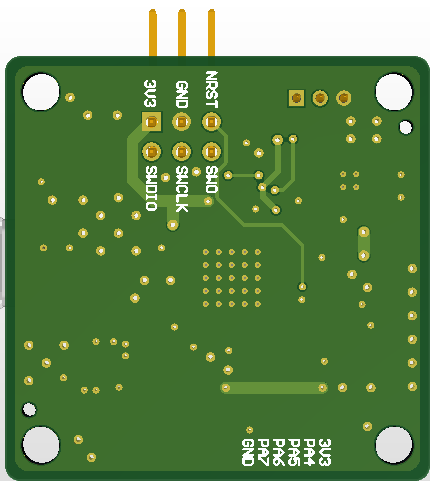

<h1 align="center">STM32 with IMU 📟</h1>

In this project, you will find a compact PCB that integrates the **STM32F411CEU6** microcontroller with the **MPU6050** gyroscope and accelerometer sensor via an I2C bus. You can use it for robotics or motion data acquisition applications. 🤖

  

## Preview 📸

Here is a brief overview of what you will find.

  
  

## Technical Specs 📋

* **MCU:** STM32F411CEU6
* **Sensors:** MPU6050
* **Actuators:** None
* **Source:** 5V input via Micro-B USB 2.0
* **PCB Dimensions:** 36mm x 36mm x 1.67mm (4 layers)

---

## Project Structure 📚

The main editable project files you might want to review:

| Type | Description |
| ---- | ----------- |
| [**Schematics**](Board_Schematic.SchDoc) | The **schematic sheet** file, where all conections and components used can be found. |
| [**PCB**](Board_PCB.PcbDoc) | The **PCB file** where the layout, layer stackup, routing, and mechanical organization of the PCB can be view. |
| [**Libraries**](../README.md#common-components-libraries--) | All **external libraries** used in this project. If a symbol does not appear, it is because it was obtained using **Altium's** *Manufacturer Part Search* tool. |
| [**Datasheets**](./Datasheets/) | Some of the most relevant **datasheets** for the project. The names correspond to their **MPNs**. |

## Project Outputs 🗂️

The project version for preview and the ready-to-go manufacturing files.

| Type | Description |
| ---- | ----------- |
| [**Schematics**](./Outputs/Schematics/STM32_F4_w_MPU6050.pdf) | All project **schematic sheets** in **PDF** format, for the editable schematic file, please refear to this [**section**](#project-structure-). |
| [**Layout**](./Outputs/Layout/Layout_STM32_F4_w_MPU6050.pdf) | The **PCB design** in grayscale and **PDF** format, for the editable PCB file please refear to this [**section**](#project-structure-). |
| [**PCB render**](./Outputs/Layout/3D_STM32_F4_w_MPU6050.pdf) | A **3D-PDF render** of the PCB. *Please use a dedicated PDF viewer to open the 3D-PDF file, it may not work correctly when previewed in **GitHub** or **Chrome**.* |
| [**Manufacturing files**](./Outputs/Manufacturing/) | Gerber, CPL and BOM files ready for manufacturing. The **BOM** file includes **JLCPCB** MPNs, also the **DRC** was based on JLCPCB capabilities. |

---

## Last but not least 🫂
©️ Full credit for the design goes to [**Phil's Lab**](https://www.youtube.com/watch?v=PMEpQZ90f34), you can check out his [**YouTube channel**](https://www.youtube.com/@PhilsLab) to find more useful resources and projects.